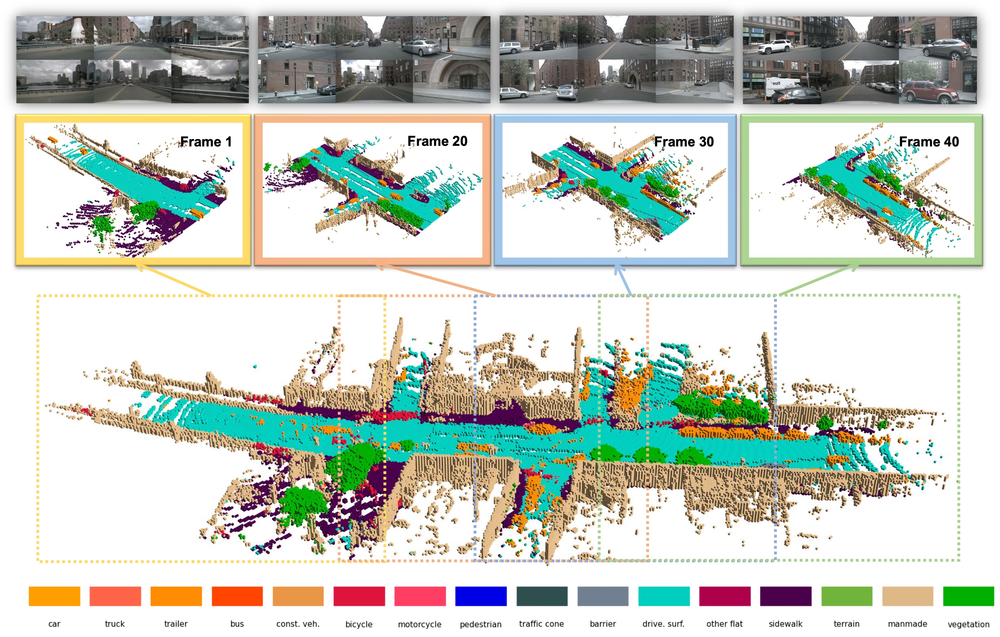
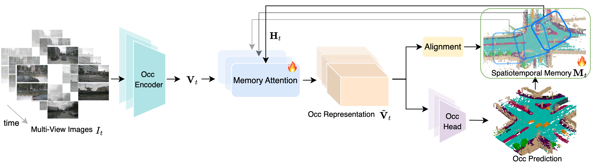

# ST-Occ: Occupancy Learning with Spatiotemporal Memory

[](https://www.arxiv.org/abs/2508.04705)&nbsp;

<p align="center">
  
</p>

**ST-Occ** is a scene-level occupancy representation learning framework that effectively learns the spatiotemporal feature with temporal consistency.


<p align="center">
  
</p>

## Installation

```
# Coming soon
```

## Citation

Consider citing our paper if you find our paper is useful for your research:

```
@article{leng2025occupancy,
    title={Occupancy Learning with Spatiotemporal Memory},
    author={Ziyang Leng and Jiawei Yang and Wenlong Yi and Bolei Zhou},
    journal={ICCV},
    year={2025},
}
```